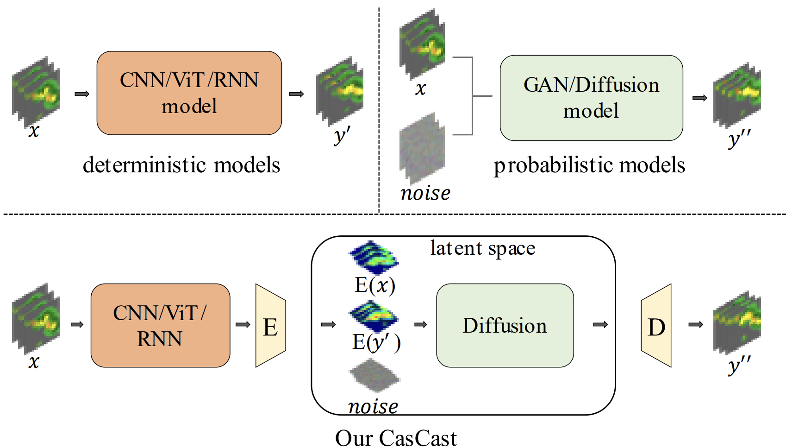

## CasCast: Skillful High-resolution Precipitation Nowcasting via Cascaded Modelling<br><sub>Official PyTorch Implementation</sub>

### [Paper](https://arxiv.org/pdf/2402.04290)


This repo contains PyTorch model definitions, pre-trained weights and training/sampling code for our paper exploring decoupling the precipitation nowcasting with deterministic part and probabilistic part (diffusion models). 

> [**CasCast: Skillful High-resolution Precipitation Nowcasting via Cascaded Modelling**](https://arxiv.org/pdf/2402.04290)<br>
> [Junchao Gong](https://github.com/OpenEarthLab), [Lei Bai](http://leibai.site/), etc.
> <br>Shanghai Jiao Tong University, Shanghai AI Laboratory<br>

Two key challenges of precipitation nowcasting are not well-solved: (i) the modeling of complex precipitation system evolutions with different scales, and (ii) accurate forecasts for extreme precipitation. We propose CasCast, a cascaded framework composed of a deterministic and a probabilistic part to decouple the predictions for mesoscale precipitation distributions and small-scale patterns.
We train a deterministic model in pixel space and a DiT-based probabilistic model in latent space to model the complex precipitation system evolutions with different scales.  



This repository contains:

* 🪐 A simple PyTorch [implementation](networks/casformer.py) of CasFormer based on DiT.
* ⚡️ Pre-trained deterministic model EarthFormer([model](networks/earthformer_xy.py), [checkpoint](https://drive.google.com/file/d/1ZrUgJMbx4hRE4uA0Y43m4Q1OPwA_R_Ow/view?usp=drive_link)), pre-trained auto-encoder model([model](networks/autoencoder_kl.py), [checkpoint](https://drive.google.com/file/d/18HaCuLpiX15Os5XCOqoenj2r__2cRHm7/view?usp=drive_link)), pre-trained probabilistic model CasFormer([model](networks/casformer.py), [checkpoint](https://drive.google.com/file/d/1CoUsHmBcTiv1vqj8I88c16RIlNOCSuZi/view?usp=drive_link)) on **sevir** dataset.
* 🛸 A [training script](train.py) using PyTorch DDP on **SLURM** platform. 

## Setup
First, download and set up the repo:
```bash
git clone https://github.com/OpenEarthLab/CasCast.git
cd CasCast
```

Deploy the environment given below:
```
python version 3.9.17
torch==2.0.1+cu118
```

## Inferencing

You can inference from our pretrained probabilistic model with our preprocessed deterministic predictions. First, download the [pretrained probabilistic model](https://drive.google.com/file/d/1CoUsHmBcTiv1vqj8I88c16RIlNOCSuZi/view?usp=drive_link) into **cascast/experiments/cascast_diffusion/world_size1-ckpt/checkpoint_best.pth**. Then, download the preprocessed(compressed into latent space) [predictions](https://drive.google.com/file/d/19nteuOjmnJxiy8Y5H9ygH8pnVsTPkvfK/view?usp=drive_link) into **latent_data** and unzip it. Finally, download the checkpoint of the [autoencoder](https://drive.google.com/file/d/18HaCuLpiX15Os5XCOqoenj2r__2cRHm7/view?usp=drive_link) as **ckpts/autoencoder/ckpt.pth**.

```
bash ./scripts/eval_diffusion_infer.sh
```


## Training

### step1. Training the deterministic part
#### preprocess SEVIR dataset
* Download SEVIR VIL dataset from https://github.com/MIT-AI-Accelerator/neurips-2020-sevir?tab=readme-ov-file.
*  Split SEVIR VIL dataset according to https://github.com/amazon-science/earth-forecasting-transformer. An event with 49 frames is split into three sample part 0->24, 12->36, 24->49.
* Our split is the same as https://github.com/amazon-science/earth-forecasting-transformer. We give the details in [sevir_list](datasets/sevir_list/train.txt). For training split, we have 35718 samples. For validation and test split, we have 9060 and 12159 samples.
* For a npy name **vil-2019-SEVIR_VIL_RANDOMEVENTS_2019_0501_0831.h5-0-1.npy** in [sevir_list](datasets/sevir_list/train.txt), **vil-2019-SEVIR_VIL_RANDOMEVENTS_2019_0501_0831** is the name of the **.h5** file in the source data downloaded from https://github.com/MIT-AI-Accelerator/neurips-2020-sevir?tab=readme-ov-file. **0** is the file index, and **1** indicates the sample is composed of frames **12->36**(0 for frames **0->24**, and 2 for frames **24->49**).
* Store the preprocessed SEVIR dataset (npy samples) into **pixel_data/sevir/train_2h**,  **pixel_data/sevir/val_2h** and  **pixel_data/sevir/test_2h**.

Set the **data_dir** in **configs/sevir_used/EarthFormer.yaml** as the sevir path you use, such as **pixel_data/sevir**. **Training deterministic model** EarthFormer by 
```
bash ./scripts/train_deterministic.sh
```

**Evaluating deterministic model** EarthFormer by
```
bash ./scripts/eval_deterministic.sh
```

### step2. Training the autoencoder part
We use an autoencoder to compress samples into latent space. Training the autoencoder by 
```
bash ./scripts/train_autoencoder.sh
```

### step3. Training the probabilistic part
#### preprocess samples and predictions of the deterministic part
To speed up the training pipeline of the probabilistic part of CasCast, we compress the ground truth of the future radar echoes and the predictions of the deterministic part into latent space in advance.

Compressing ground truth by 
```
bash ./scripts/compress_gt.sh
```

Compressing the predictions of the EarthFormer as the deterministic part
```
bash ./scripts/compress_earthformer.sh
```

The compressed data are saved in **latent_data/sevir_latent/48x48x4**.

**Training the diffusion model** in latent space.

Set **data_dir**, **latent_gt_dir**, and **latent_deterministic_dir**  in configs/sevir_used/cascast_diffusion.yamlsevir_used/cascast_diffusion.yaml. **data_dir** is the path to sevir used in step **Training the deterministic part**. **latent_gt_dir** is the path where compressed gt saved in, and **latent_deterministic_dir** is the path where compressed predictions saved in.
```
bash ./scripts/train_diffusion.sh
```

## Evaluation
Evaluating the deterministic model
```
bash ./scripts/eval_deterministic.sh
```

Evaluating the diffusion model
```
bash ./scripts/eval_diffusion.sh
```

## BibTeX

```bibtex
@article{gong2024cascast,
  title={CasCast: Skillful High-resolution Precipitation Nowcasting via Cascaded Modelling},
  author={Gong, Junchao and Bai, Lei and Ye, Peng and Xu, Wanghan and Liu, Na and Dai, Jianhua and Yang, Xiaokang and Ouyang, Wanli},
  journal={arXiv preprint arXiv:2402.04290},
  year={2024}
}
```
